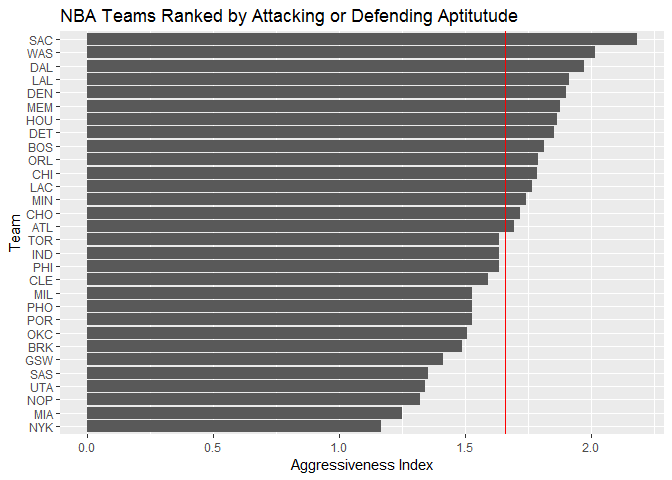

workout01-kulunu-dharmakeerthi
================

``` r
library(dplyr)
```

    ## 
    ## Attaching package: 'dplyr'

    ## The following objects are masked from 'package:stats':
    ## 
    ##     filter, lag

    ## The following objects are masked from 'package:base':
    ## 
    ##     intersect, setdiff, setequal, union

``` r
library(ggplot2)
library(readr)
```

``` r
nba2018 <- read_csv("../data/nba2018-teams.csv")
```

    ## Warning: Missing column names filled in: 'X1' [1]

    ## Parsed with column specification:
    ## cols(
    ##   X1 = col_integer(),
    ##   team = col_character(),
    ##   experience = col_integer(),
    ##   salary = col_double(),
    ##   points3 = col_integer(),
    ##   points2 = col_integer(),
    ##   points1 = col_integer(),
    ##   points = col_integer(),
    ##   off_rebounds = col_integer(),
    ##   def_rebounds = col_integer(),
    ##   assists = col_integer(),
    ##   steals = col_integer(),
    ##   blocks = col_integer(),
    ##   turnovers = col_integer(),
    ##   fouls = col_integer(),
    ##   efficiency = col_double()
    ## )

``` r
ggplot(nba2018, aes(x=reorder(team,salary), y=salary)) + geom_bar(stat='identity') + coord_flip() + geom_hline(yintercept=as.numeric(mean(nba2018$salary), size = 10, alpha = 0.5), col = "red") + labs(y = "Salary (in millions)", x = "Team") + ggtitle("NBA Teams Ranked by Total Salary")
```


``` r
ggplot(nba2018, aes(x=reorder(team,points), y=(points))) + geom_bar(stat='identity') + coord_flip() + geom_hline(yintercept=as.numeric(mean(nba2018$points)), col = "red") + labs(y = "Points", x = "Team") + ggtitle("NBA Teams Ranked by Total Points")
```


``` r
ggplot(nba2018, aes(x=reorder(team,efficiency), y=(efficiency))) + geom_bar(stat='identity') + coord_flip() + geom_hline(yintercept=as.numeric(mean(nba2018$efficiency)), col = "red") + labs(y = "Efficiency", x = "Team") + ggtitle("NBA Teams Ranked by Efficiency")
```

 \#\#\#A 4th way Another good statistic is Steals/Blocks as a ratio to gauge whether a team is more offensive or defensive. To do this we must add another column to the loaded csv. Lets call this column "aggressiveness". A higher ratio indicates an attacking style of play, and vice versa.

``` r
nba2018 <- mutate(nba2018, aggressiveness = steals/blocks)
ggplot(nba2018, aes(x=reorder(team,aggressiveness), y=(aggressiveness))) + geom_bar(stat='identity') + coord_flip() + geom_hline(yintercept=as.numeric(mean(nba2018$aggressiveness)), col = "red") + labs(y = "Aggressiveness Index", x = "Team") + ggtitle("NBA Teams Ranked by Attacking or Defending Aptitutude")
```



Comments and Reflections
------------------------

Working with git as a method to create and organise a file structure was initially quite difficult, although the practice I have had in labs certianly helped. No git commands were new, and the process was fairly smooth. I was constantly reminding myself to chack git status and push changes to the online repository. I have had experience with relative paths and Rscript before. Defnitely ggplot is still the most confusing aspect of R, although by now I am fairly used to its peculiarities. Manipulating tibbles and dataframes was still frustrating at times, particularly when using pipe operators. However, I found the sink() function, which although we have not covered much in class, to be quite easy to use. Noone helped me complete this homework, and it took around 3 hours to complete. The most time consuming part was the data preparation stage, but all in all this was a very interesting project; giving us an insight into the field of data analysis and manipulation
